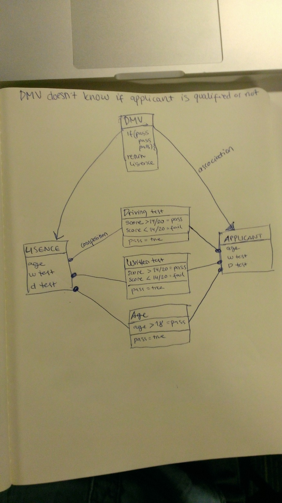

This model is to illustrate the process of an individual getting issued a Driver's License for the first time. This process begins with the individual submitting their information into the DMV's portal. The information being submitted by the individual is:

1. Age 
2. Written exam score 
3. Driver's test score

This information gives a description to the DMV office about the invidual requesting a new license. When the DMV location receives a request from the individual for a new license, they will be reviewing the below information:

1. Is this individual 18 years or older?
2. Has this individual pass their written exam?
3. Has this individual pass their driving exam?

If all these requirements have been met, then the DMV office will approve this individual for a new license. 

